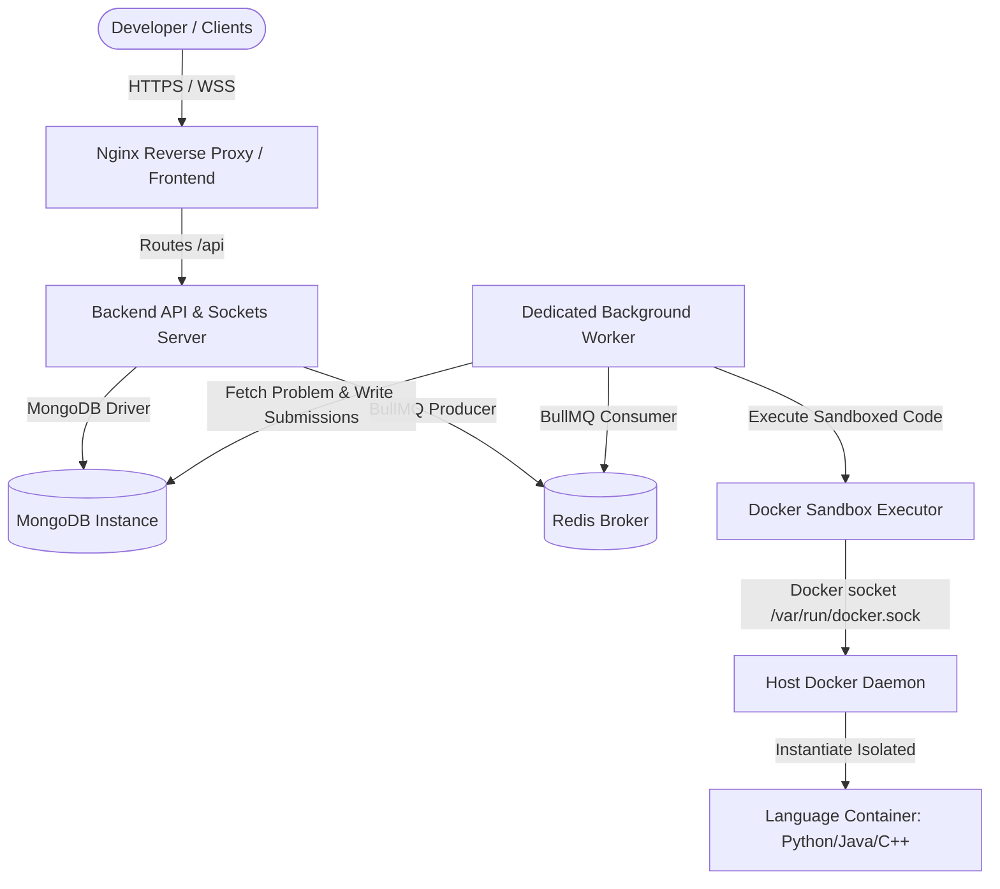
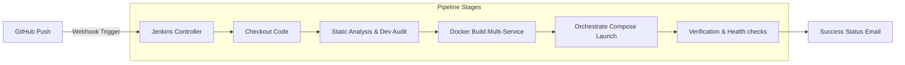

# CodeBrawl DevOps Deployment & Architecture Guide 🚀

This comprehensive guide describes the transformed production-grade DevOps multi-container microservices architecture of the **CodeBrawl Multiplayer Coding Arena** platform. It has been redesigned to satisfy advanced DevOps engineering evaluations.

---

## 🏗️ 1. Multi-Container Orchestration Architecture

The system is decoupled into isolated single-responsibility microservices. Communication is achieved securely through a private virtual bridge network, and tasks are processed asynchronously via an executive message queue.

### High-Level Architecture Diagram


---

## 🗄️ 2. The 6-Service Microservice Landscape

Our architecture is orchestrated using a custom multi-container configuration defined in `docker-compose.yml`:

| Service Name | Base Technology | Host Port | Role & System Context |
| :--- | :--- | :--- | :--- |
| **`mongodb`** | `mongo:latest` | `27017` | Persistent data archive for users, historical matches, and coding problems. |
| **`redis`** | `redis:alpine` | `6379` | High-throughput broker used for room caches and the BullMQ background queue. |
| **`backend`** | `node:18-alpine` | `5000` | HTTP Express API and real-time Socket.io bi-directional game loop engine. |
| **`worker`** | `node:18-alpine` | *Internal* | Asynchronous CPU-offload consumer. Reads submissions, saves state to DB, and updates standings. |
| **`execution-service`**| `node:18-slim` (+Docker) | `5001` | Sandbox controller that mounts `/var/run/docker.sock` to run sibling language containers on the host. |
| **`frontend`** | `nginx:1.25-alpine` | `80` | Compiles Vite+React code and serves it with an Nginx engine. |

---

## 🛠️ 3. Continuous Integration & Continuous Deployment (CI/CD)

The automated delivery pipeline is defined declaratively inside the `Jenkinsfile` and `JenkinsFile`.

### CI/CD Pipeline Workflow


### Jenkins Stages Detail:
1. **Checkout Protocol**: Pulls the revision code from the main Git branch securely.
2. **Static Analysis & Lint**: Automatically pulls devDependencies to run ESLint formatting checks.
3. **Security Vulnerability Audit**: Evaluates active dependencies for known high-risk vulnerabilities via `npm audit`.
4. **Docker Compilation**: Triggers a concurrent compile of all 4 microservice Dockerfiles.
5. **Orchestration Deployment**: Shuts down older running instances and launches the new build stack in detached `-d` mode.
6. **System Verification & Health Check**: Actively pings frontend Nginx and backend HTTP systems using `curl` to ensure successful initialization.
7. **Asset Pruning**: Safely removes redundant and dangling Docker images to preserve system memory.

---

## 🔒 4. Production Security Hardening

The application is hardened against malicious vectors:
*   **Sandbox Isolation**: User-submitted code executes in ephemeral containers (`--rm`), capped at a maximum of `10000ms`, and has zero access to host resources.
*   **Security Headers (Helmet)**: Express utilizes `helmet()` middleware to automatically strip identifier headers (e.g. `X-Powered-By`) and enforce HTTPS security headers.
*   **Rate Limiting**: Integrated `express-rate-limit` allowing a maximum of `100` requests per `15 minutes` per IP address.
*   **NoSQL Injection Safeguard**: Evaluates and sanitizes incoming request payloads (`req.body` and `req.params`) using `express-mongo-sanitize` to purge MongoDB operators (e.g. `$gt`).
*   **Environment-Based CORS**: Replaced open wildcard access with a whitelist mechanism that splits `process.env.ALLOWED_ORIGINS`.

---

## 🚀 5. Quick Start Instructions (Local Docker Run)

To run the entire 6-container microservice system locally, ensure you have **Docker** and **Docker Compose** installed:

### 1️⃣ Clone and Prepare Config
```bash
git clone https://github.com/YOUSRA786/Multiplayer-coding-arena.git
cd multiplayer-coding-arena
cp .env.example .env
```

### 2️⃣ Run with Docker Compose
```bash
docker compose up --build -d
```
*   `--build`: Compiles the Custom Node.js & Nginx containers.
*   `-d`: Runs the orchestration stack in the background (detached).

### 3️⃣ Verify Infrastructure Status
```bash
docker compose ps
```
The console will output the active running containers:
*   `mca-frontend` (Nginx, Port `80`)
*   `mca-backend` (Node, Port `5000`)
*   `mca-execution-service` (Node + Docker, Port `5001`)
*   `mca-worker` (Node, background queue listener)
*   `mca-mongodb` (Mongo, Port `27017`)
*   `mca-redis` (Redis, Port `6379`)

---

## ☁️ 6. AWS EC2 Deployment Architecture

For academic deployment evaluation, the optimal setup uses an AWS EC2 instance:

```text
               [ AWS VPC Environment ]
                       ↓
              [ EC2 Instance (Ubuntu) ]
                       ↓
            [ Host Docker Engine ]
  ┌──────────────────────────────────────────────┐
  │  [mca-frontend] ──► [mca-backend]           │
  │     (Port 80)          (Port 5000)           │
  │                            │                 │
  │                     [mca-worker]             │
  │                       │         │            │
  │               [mca-redis]     [mca-mongodb]  │
  │                (Port 6379)     (Port 27017)  │
  │                                              │
  │            [mca-execution-service]           │
  │                  (Port 5001)                 │
  └──────────────────────────────────────────────┘
```

### Deploying to an EC2 instance:
1. **Launch EC2 Instance**: Use an `Ubuntu Server 22.04 LTS` (t2.medium recommended for compilation speed).
2. **Configure Security Groups**: Open port `80` (HTTP), `5000` (Backend API), and `5001` (Execution sandbox) to authorized IPs.
3. **Install Docker Ecosystem**:
   ```bash
   sudo apt-get update
   sudo apt-get install -y docker.io docker-compose-v2
   sudo usermod -aG docker ubuntu
   # Log out and log back in to apply docker group permissions
   ```
4. **Deploy using Automated Script**:
   ```bash
   chmod +x deploy.sh
   ./deploy.sh
   ```
5. **Configure Production Sibling Mounting**:
   Edit the `.env` file on your AWS host and set:
   ```env
   HOST_TEMP_DIR=/home/ubuntu/arena/execution-service/src/temp
   ```
   This tells the execution service container where the workspace folder lies on the host, guaranteeing Docker-out-of-Docker sibling mounts will work flawlessly!
